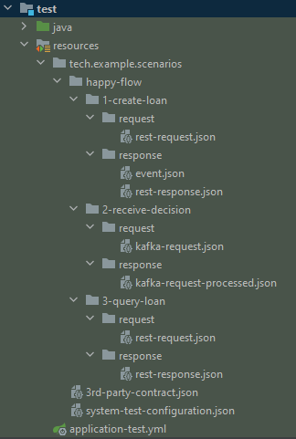

## Getting started
This is a project that demonstrates using of [System Test Framework](https://github.com/INK-Solutions/system-test-framework) - our custom, business oriented Java-based testing framework, that allows you to define steps that are part of a business processes, and then make sure business process are executed.

## Business process
The business goal of this demo project is to allow clients to request a loan.
The business process is realized in following steps:
1. User requests the loan.
2. Application obtains KYC status of the client from an external service.
3. The user receives response with the request details.
   - Loan approval request event is saved in DB.
   - Loan approval request event is sent to Kafka.
4. When loan request in approved, the application receives Kafka event with the request status.
5. User us able to query details of the requested loan.

## System tests coverage
The business process is fully cover by system tests that use our [System Test Framework](https://github.com/INK-Solutions/system-test-framework).

1. User requests the loan - it's covered by `1-create-loan` step.
2. Application obtains KYC status of the client from an external service - the call to external KYC API is mocked with Mocked Server. Mocking is configured in `3rd-party-contract.json` file.
3. The user receives response with the request details. - this is verified in the `rest-response.json` and `event.json` that are in the `response` directory of `1-create-loan` step.
4. When loan request in approved, the application receives Kafka event with the request status - it is verified in `2-receive-decision` step.
5. User us able to query details of the requested loan - is verified by `3-query-loan` step.

## System test configuration
The framework uses a minimal about of code to set up and execute the tests.
`DefaultSystemTest` class demonstrates full Java code that is needed.

Remaining configuration and test steps are created with JSON.
Required infrastructure configurations is defined in `system-test-configuration.json` file.